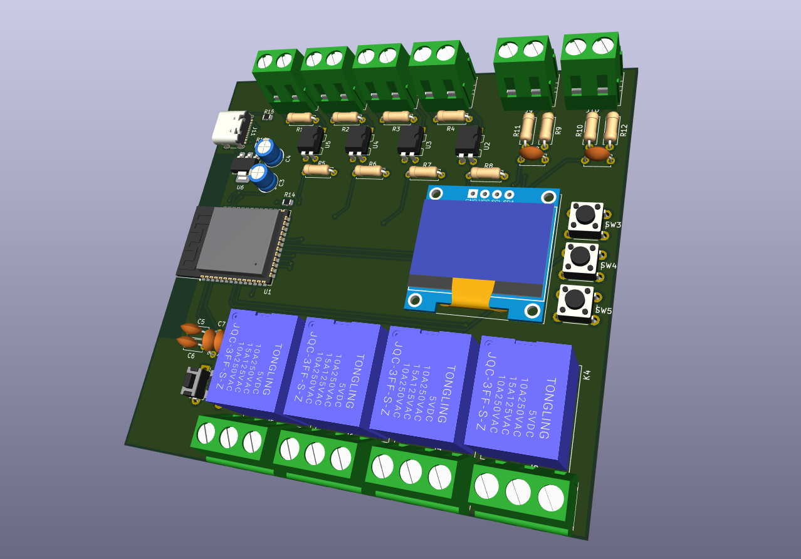

# ES-PLC32
The ES-PLC32 or ESPLC or ESPPLC (I can't decide on a name) is a programmable logic computer with four digital inputs, two analog inputs, and four outputs capable of switching 240VAC loads at 10A (thanks to relays.)

## Digital Inputs
The four digital inputs should be able to handle up to 24v at 20mA but realistically should be used at 3.3v or 5v. The inputs are electrically isolated from the ESP32 via the pc817 optocoupler.

## Analog Inputs
The analog inputs are insanely dangerous to use. It is only able to handle 3.3v-5v and is absolutely not electrically isolated from the ESP32, so any power you push in through that input, will go through two resistors to divide the 5v to 3.3v (or 3.3v to 1v ish) and then directly to the ESP32.

## Outputs
The outputs are purely digital and can be used to drive pumps, turn on lights, open motorized valves, and such. There are no analog outputs because I found it too difficult to add one in, and for a PLC this simple, it generally isnt needed.

## Screen and buttons
The 0.96" 128x64 OLED display can be used to change setpoints for anything, view variables live, to restart the program, or start/stop hosting the programming interface, and show the ip for the programming interface.