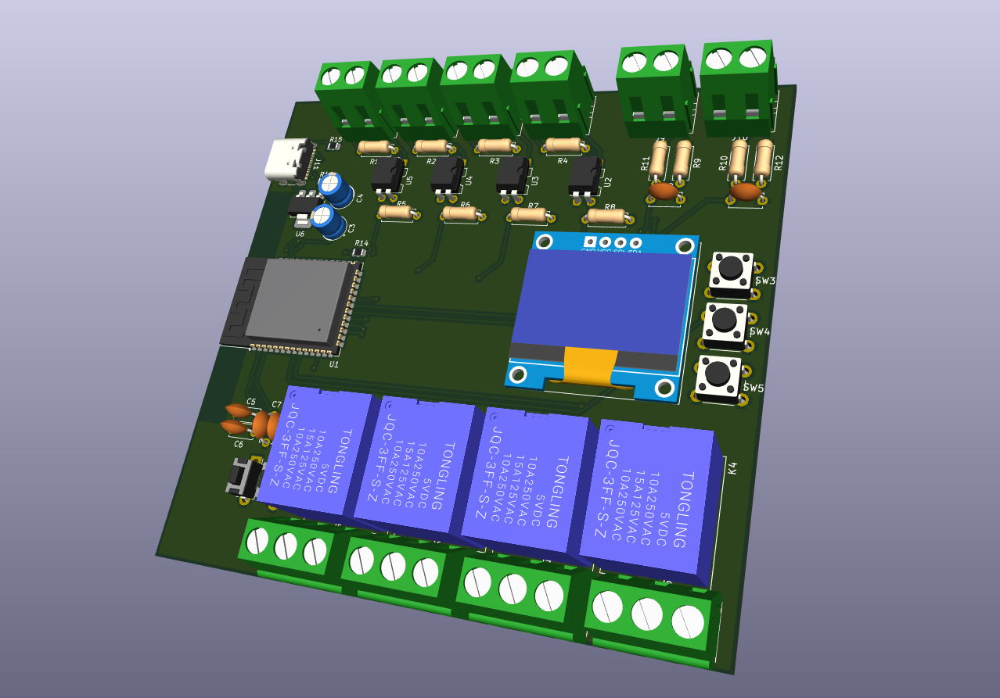
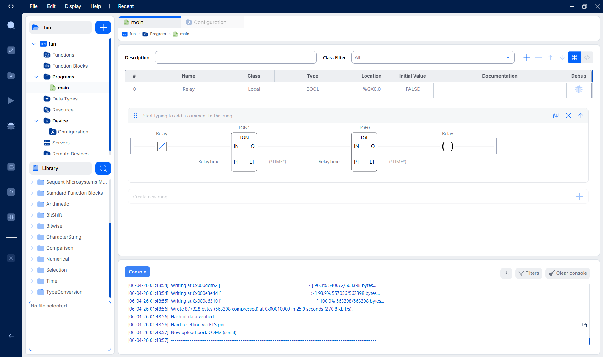
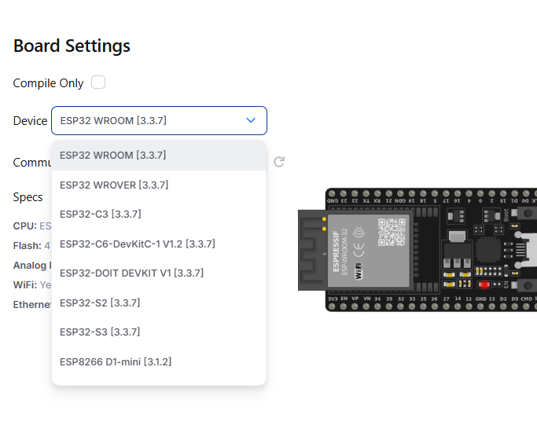

# ES-PLC32
The ES-PLC32 is an affordable programmable logic computer with four digital inputs, two analog inputs, and four outputs.
> [!WARNING]
> The ES-PLC32 is not [IEC 61131](https://en.wikipedia.org/wiki/IEC_61131) compliant.

## Digital Inputs
The four digital inputs should be able to handle up to 24v at 20mA but realistically should be used at 3.3v or 5v. The inputs are electrically isolated from the ESP32 via the pc817 optocoupler.

## Analog Inputs
The analog inputs are insanely dangerous to use. It is only able to handle 3.3v-5v and is absolutely not electrically isolated from the ESP32, so any power you push in through that input, will go through two resistors to divide the 5v to 3.3v (or 3.3v to 1v ish) and then directly to the ESP32. (this will be resolved in a later iteration)

## Outputs
The outputs are purely digital and can be used to drive pumps, turn on lights, open motorized valves, and such. There are no analog outputs to keep it affordable.

## Screen and buttons
The 0.96" 128x64 OLED display can be used to change setpoints for anything, view variables live, to restart the program, or start/stop hosting the programming interface, and show the ip for the programming interface.

## Software
The ES-PLC32 uses [OpenPLC](https://autonomylogic.com/) to program in ladder logic (and other languages) and to upload the program to the ES-PLC32. It is recommended to use functional block diagram rather than ladder logic as OpenPLC seems to hate ladder logic a lot.

It has inbuilt support for the ESP32-S3 by default and can upload code to it perfectly fine with no issues.

